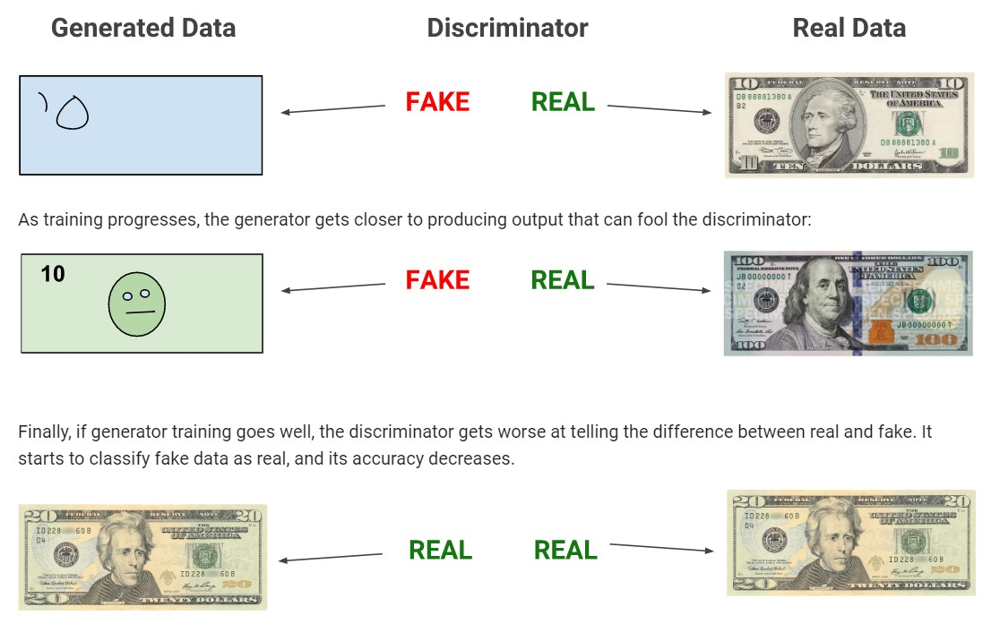
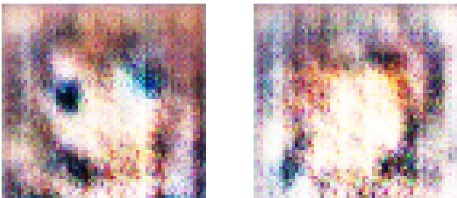
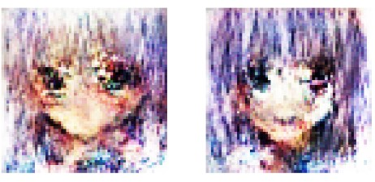
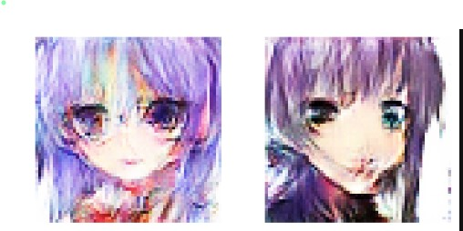

  
<h1 style = 'color:#f2d53c'> CapeStone: Genrate Faces with   Generative Adversarial Network </h1>

The goal of this project is to generate fake faces and make it look like real ones that never existed before by feeding the Network with some Noise.
So I want to build Genreative advirtisal network 
and try to find if it  possible ? That it can generate Fake FACES THAT LOOK LIKE REAL from Noise 

<h4 style = 'color:#f2d53c'> THE DATASET</h4>

- Human Faces https://www.kaggle.com/c/deepfake-detection-challenge/discussion/122786#700963
- Anime Faces https://www.kaggle.com/soumikrakshit/anime-faces
- Simpson Faces https://www.kaggle.com/kostastokis/simpsons-faces

<h1 style = 'color:#f2d53c'> Bulding GAN </h1>

- replace pooling layer with Conv2DTranspose 
- use BatchNormalization in both g and disc expect for gen  outpot layer and dis input layer 
-  genrator activtion should be LeakyReLU or ReLU expect output layer we use tanh 
- all layers in disc shplud use LeakyReLU or ReLU

<a href ='https://arxiv.org/abs/1511.06434'> check this paper </a> 

<h1 style = 'color:#f2d53c'> Results </h1>

<iframe width="457" height="210" style="position:absolute;top:0;left:0;width:100%;height:100%;" frameBorder="0" src="https://imgflip.com/embed/3ww9q0"></iframe>

<a href="https://imgflip.com/gif/3ww9q0">via Imgflip</a>

